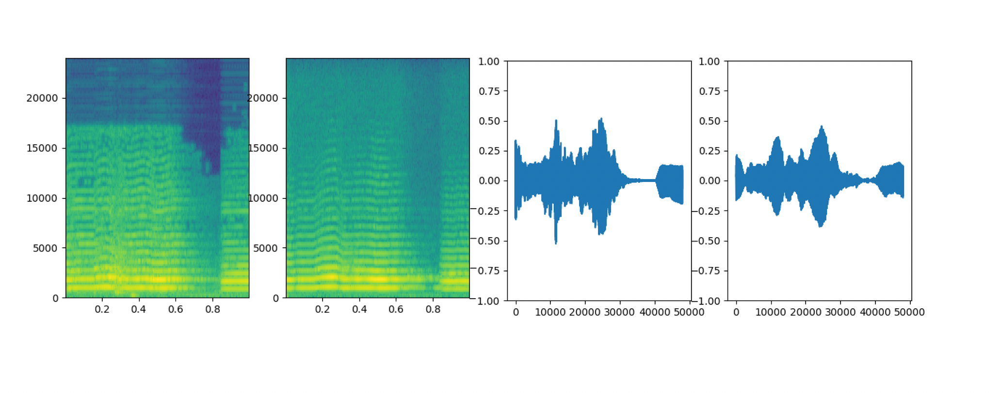
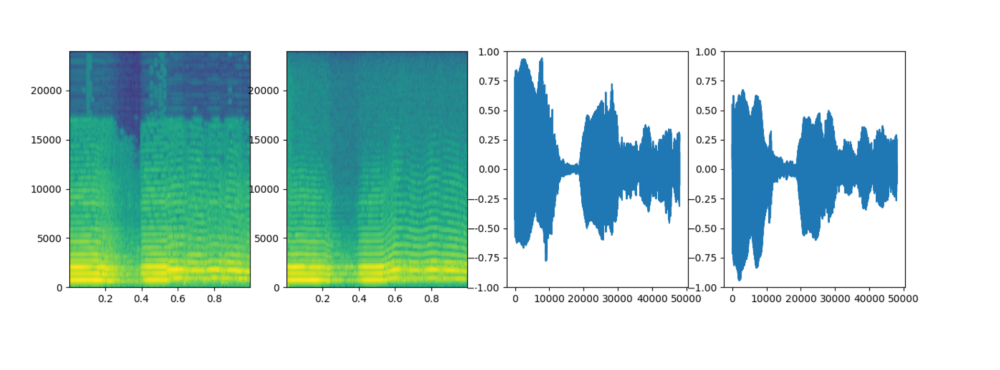
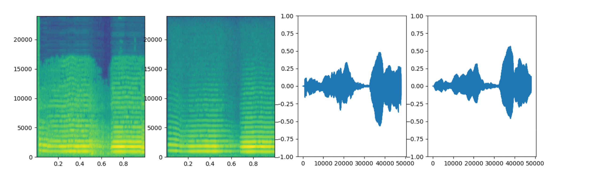

### Transferring Erhu timbre using Realtime DDSP in PyTorch compatible with neutone 

#### **Objective**
The goal is using the DDSP framework to train the sound of the Erhu, a traditional Chinese two-stringed bowed instrument, and export the model to Neutone (a realtime tone morphing plugin).
I have been working on DDSP timbre transfer for the Erhu, since there is not many Erhu sound sources or plugin, so I want to use DDSP training a high quality Erhu sound.

#### **Data Management**
**Data Identification:** Monophonic and single instrument wav or mp3 files located in the google drive.

**Data Collection:** The monophonic recordings of Erhu, capturing its full expressive range, including all the playing techniques and nuances in between. I recorded 30mins long mp3 files as the training datasets and located it in my google drive ready to train.

**Data Preprocessing:** The datasets will be preprocessed to fit the requirements of the DDSP model. This includes sampling rate normalization, amplitude scaling, and potentially segmenting longer recordings into manageable lengths. Challenges anticipated include ensuring data quality and compatibility with the model input requirements.

The [notebook](https://colab.research.google.com/drive/1yPHU6PRWw1lRWZLUxXimIa6chFQ2JdRW?usp=sharing) is from [here](https://github.com/hyakuchiki/realtimeDDSP?tab=readme-ov-file) !!

### Spectrograms and waveforms of the original audio (left) and the reconstruction by the model (right)

[some training process](https://drive.google.com/drive/folders/1biiq5l4EwbZAj9hAdvfscB4WYmuM6vIs)

I will figure out the model exporting to the Neutone ;))